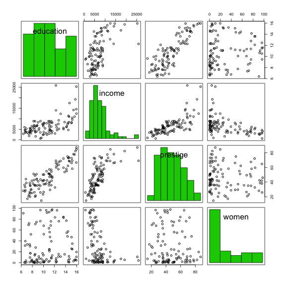
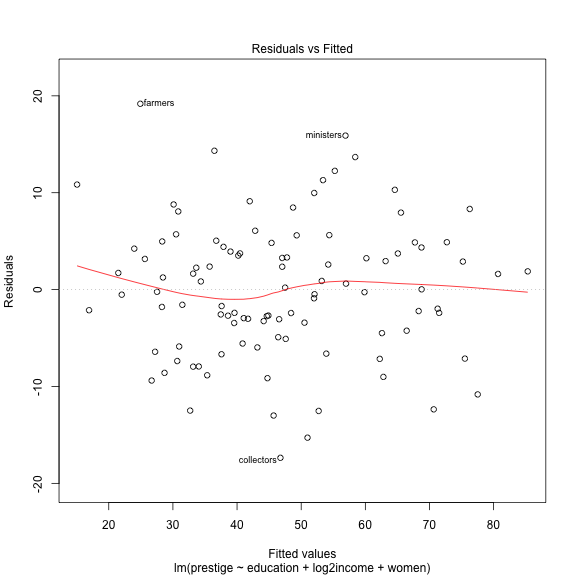
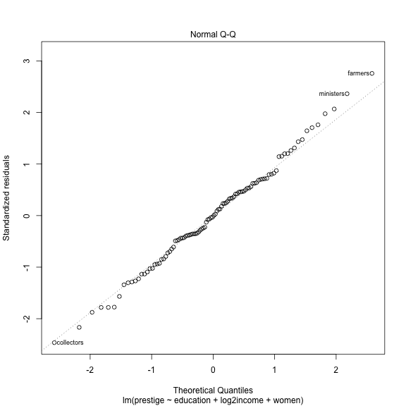
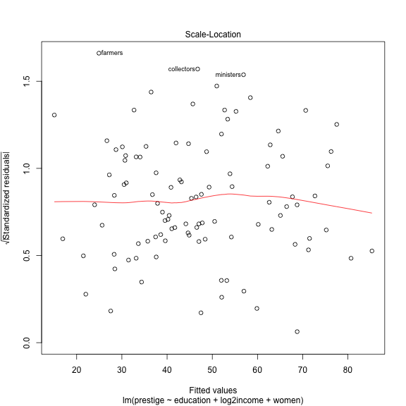
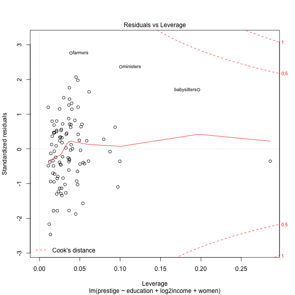

<!-- R Commander Markdown Template -->

Replace with Main Title
=======================

### Your Name

### 2017-02-08


```r
> data(Prestige, package="car")
```


```r
> summary(Prestige)
```

```
   education          income          women           prestige    
 Min.   : 6.380   Min.   :  611   Min.   : 0.000   Min.   :14.80  
 1st Qu.: 8.445   1st Qu.: 4106   1st Qu.: 3.592   1st Qu.:35.23  
 Median :10.540   Median : 5930   Median :13.600   Median :43.60  
 Mean   :10.738   Mean   : 6798   Mean   :28.979   Mean   :46.83  
 3rd Qu.:12.648   3rd Qu.: 8187   3rd Qu.:52.203   3rd Qu.:59.27  
 Max.   :15.970   Max.   :25879   Max.   :97.510   Max.   :87.20  
     census       type   
 Min.   :1113   bc  :44  
 1st Qu.:3120   prof:31  
 Median :5135   wc  :23  
 Mean   :5402   NA's: 4  
 3rd Qu.:8312            
 Max.   :9517            
```


```r
> local({
+   .Table <- with(Prestige, table(type))
+   cat("\ncounts:\n")
+   print(.Table)
+   cat("\npercentages:\n")
+   print(round(100*.Table/sum(.Table), 2))
+ })
```

```

counts:
type
  bc prof   wc 
  44   31   23 

percentages:
type
   bc  prof    wc 
44.90 31.63 23.47 
```


```r
> scatterplotMatrix(~education+income+prestige+women, reg.line=FALSE, 
+   smooth=FALSE, spread=FALSE, span=0.5, ellipse=FALSE, levels=c(.5, .9), 
+   id.n=0, diagonal = 'histogram', data=Prestige)
```




```r
> scatterplotMatrix(~education+income+prestige+women, reg.line=FALSE, 
+   smooth=FALSE, spread=FALSE, span=0.5, ellipse=FALSE, levels=c(.5, .9), 
+   id.n=0, diagonal = 'histogram', data=Prestige)
```


```r
> scatterplotMatrix(~education+income+prestige+women, reg.line=FALSE, 
+   smooth=TRUE, spread=FALSE, span=0.5, ellipse=FALSE, levels=c(.5, .9), 
+   id.n=0, diagonal = 'histogram', data=Prestige)
```


```r
> scatterplotMatrix(~education+income+prestige+women, reg.line=FALSE, 
+   smooth=TRUE, spread=FALSE, span=0.5, ellipse=FALSE, levels=c(.5, .9), 
+   id.n=0, diagonal = 'histogram', data=Prestige)
```


```r
> Prestige$log2income <- with(Prestige, log2(income))
```


```r
> RegModel.1 <- lm(prestige~education+log2income+women, data=Prestige)
> summary(RegModel.1)
```

```

Call:
lm(formula = prestige ~ education + log2income + women, data = Prestige)

Residuals:
    Min      1Q  Median      3Q     Max 
-17.364  -4.429  -0.101   4.316  19.179 

Coefficients:
             Estimate Std. Error t value Pr(>|t|)    
(Intercept) -110.9658    14.8429  -7.476 3.27e-11 ***
education      3.7305     0.3544  10.527  < 2e-16 ***
log2income     9.3147     1.3265   7.022 2.90e-10 ***
women          0.0469     0.0299   1.568     0.12    
---
Signif. codes:  0 '***' 0.001 '**' 0.01 '*' 0.05 '.' 0.1 ' ' 1

Residual standard error: 7.093 on 98 degrees of freedom
Multiple R-squared:  0.8351,	Adjusted R-squared:   0.83 
F-statistic: 165.4 on 3 and 98 DF,  p-value: < 2.2e-16
```


```r
> RegModel.2 <- lm(prestige~education+log2income+women, data=Prestige)
> summary(RegModel.2)
```

```

Call:
lm(formula = prestige ~ education + log2income + women, data = Prestige)

Residuals:
    Min      1Q  Median      3Q     Max 
-17.364  -4.429  -0.101   4.316  19.179 

Coefficients:
             Estimate Std. Error t value Pr(>|t|)    
(Intercept) -110.9658    14.8429  -7.476 3.27e-11 ***
education      3.7305     0.3544  10.527  < 2e-16 ***
log2income     9.3147     1.3265   7.022 2.90e-10 ***
women          0.0469     0.0299   1.568     0.12    
---
Signif. codes:  0 '***' 0.001 '**' 0.01 '*' 0.05 '.' 0.1 ' ' 1

Residual standard error: 7.093 on 98 degrees of freedom
Multiple R-squared:  0.8351,	Adjusted R-squared:   0.83 
F-statistic: 165.4 on 3 and 98 DF,  p-value: < 2.2e-16
```


```r
> oldpar <- par(oma=c(0,0,3,0), mfrow=c(2,2))
```


```r
> plot(RegModel.2)
```




```r
> par(oldpar)
```


